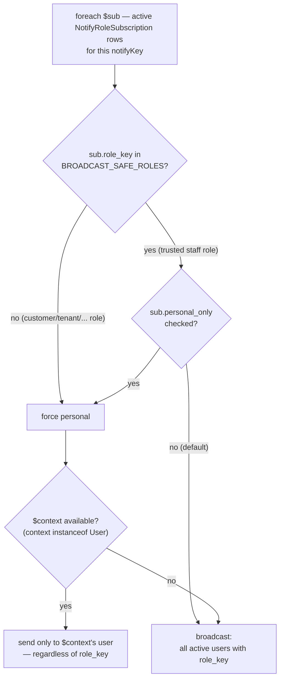
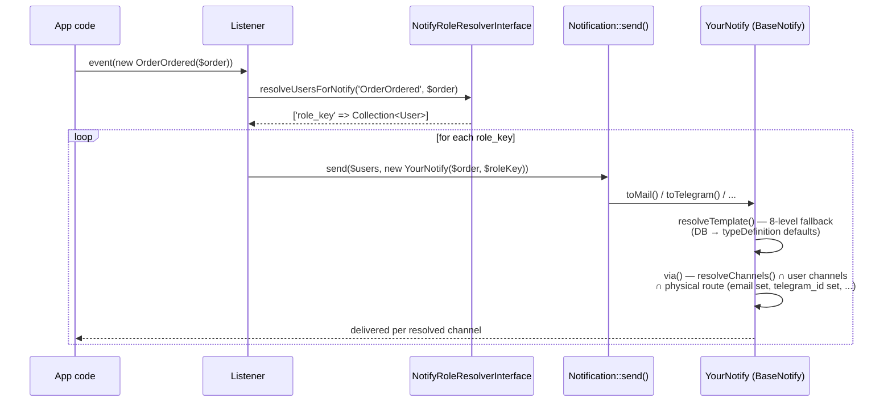

# laravel-notify-templates

DB-based notification templates for Laravel. Manages notification templates, role/user subscriptions, channel resolution, and delay — without coupling to any specific role package.

> Українська: [README.uk.md](README.uk.md)

## Concepts

- **`notify_templates`** — stores subject/body per notify type + channel slot + role + tenant, with fallback chain
- **`notify_role_subscriptions`** — which notify types are active for which role (channels, delay, personal_only)
- **`notify_user_settings`** — per-notifiable opt-out of a specific notify type (polymorphic — works with any Eloquent model, not just a `User`)
- **`BaseNotify`** — abstract base that resolves templates and channels; concrete classes live in the app
- **`NotifyTemplatesManager`** — type registry + resolve methods, available via `NotifyTemplates` facade

---

## Installation

```bash
composer require fomvasss/laravel-notify-templates
```

Publish and run migrations:

```bash
php artisan vendor:publish --tag=notify-templates-migrations
php artisan migrate
```

Publish config (optional):

```bash
php artisan vendor:publish --tag=notify-templates-config
```

---

## Configuration

`config/notify-templates.php`:

```php
return [
    'tables' => [
        'notify_templates'          => 'notify_templates',
        'notify_role_subscriptions' => 'notify_role_subscriptions',
    ],

    // All delivery channels available in the project.
    // Used as UI listing and as fallback when typeDefinition()['channels'] is empty.
    // Include only channels actually wired up in the app.
    'channels' => ['mail', 'telegram', 'sms', 'database', 'broadcast'],

    // Fallback channels when subscription has no channels configured,
    // or when via() resolves to nothing entirely
    'default_channels' => ['mail'],

    // Tenant ID: null (single-tenant), or a callable that returns the tenant ID string.
    // Used automatically by NotifyTemplatesManager (resolveTemplate/resolveChannels/resolveDelay,
    // and therefore BaseNotify) whenever no explicit $tenantId is passed — set $this->tenantId in
    // a concrete Notify class to override it per-instance.
    'tenant_id' => null,
    // 'tenant_id' => fn() => app('domain')->getId(),

    // Directories to scan for BaseNotify subclasses on boot (auto-discovery)
    'discover' => [
        app_path('Notifications'),
    ],

    // Optional: pre-register notify types via config
    'types' => [],

    // Override models in the project (e.g. to add translatable support)
    'models' => [
        'notify_template' => \Fomvasss\NotifyTemplates\Models\NotifyTemplate::class,
    ],
];
```

---

## Type Registry

### Auto-discovery (recommended)

By default the package scans `app/Notifications` on every boot — no code needed in the app. Configured via `discover` in the config:

```php
'discover' => [
    app_path('Notifications'),
],
```

Scanning is **recursive** — subdirectories like `Notifications/Order/`, `Notifications/User/` are included automatically. Set to `[]` to disable.

The package discovers all classes that extend `BaseNotify` and return a non-empty `typeDefinition()`. Safe in production — types are registered once on boot, the singleton is read-only during requests.

Manual call is also available:

```php
NotifyTemplates::discoverIn(app_path('Notifications'));
```

### Manual registration

For dynamic types (e.g. generated from DB records), register in `AppServiceProvider::boot()`:

```php
NotifyTemplates::registerTypes([
    [
        'key'      => 'UserCreated',
        'name'     => 'Користувач створено',
        'group'    => 'user',
        'weight'   => 10,
        'settings' => ['delay'],
        'tokens'   => [
            ['key' => '[user:name]',  'name' => 'Ім\'я користувача'],
            ['key' => '[user:email]', 'name' => 'Email'],
        ],
        'defaults' => [
            'mail'      => ['subject' => 'Новий користувач', 'body' => 'Користувача [user:name] створено.'],
            'messenger' => ['body' => 'Новий користувач: [user:name]'],
        ],
    ],
]);

// or from DB
foreach (Order::statusesList() as $status) {
    NotifyTemplates::registerType([
        'key'   => 'OrderStatus' . ucfirst($status['key']),
        'name'  => 'Статус: ' . $status['name'],
        'group' => 'order',
    ]);
}
```

Or statically via config:

```php
'types' => [
    ['key' => 'UserCreated', 'name' => 'Користувач створено', 'group' => 'user'],
],
```

### typeDefinition() fields

| Field | Type | Description |
|---|---|---|
| `key` | string | Unique identifier, e.g. `'OrderOrdered'` |
| `name` | string | Human-readable label for UI |
| `group` | string | Grouping key for UI tables, e.g. `'order'` |
| `weight` | int | Sort weight within the group; lower values appear first |
| `desc` | string | Optional description shown as tooltip in the UI table |
| `settings` | array | Option keys editable in the admin UI, stored in `notify_role_subscriptions.options` |
| `tokens` | array | Token hints for the template editor: `[['key' => '[order:number]', 'name' => 'Номер']]` |
| `channels` | array | Channels this notify type supports. Empty (default) — falls back to `config('notify-templates.channels')` |
| `defaults` | array | Default subject/body per channel slot, used as placeholder in the editor when no DB template exists |

`tokens` and `defaults` are UI metadata — the package does not use them for sending. `getBodyDefault()` / `getSubjectDefault()` on `BaseNotify` read from `defaults.mail` automatically. Keep them in sync.

**Custom keys.** `registerType()` stores the whole array returned by `typeDefinition()` as-is — any key beyond the
table above survives untouched and comes back from `NotifyTemplates::getType($notifyKey)['your_key']`. Useful for
project-specific extensibility without forking the package — e.g. an `allowed_roles` array to restrict which roles
a notify type can even be configured for (a type whose audience is structurally fixed — an OTP code always goes
directly to the user logging in — gains nothing from a role you'll never use), enforced in your own admin
controller/UI, not by the package.

### settings field

`settings` declares which option keys are shown in the admin UI. The only key the package reads natively is `delay`:

```php
'settings' => ['delay']
// notify_role_subscriptions.options = {"delay": 5}
// NotifyTemplates::resolveDelay() returns 5 * 60 = 300 seconds
```

Any other keys are project-defined — read them via `$subscription->getOption('key')`.

**Recommended controller pattern** — save all `settings` keys generically so adding a new option requires no controller changes:

```php
$settings = NotifyTemplates::getType($notifyKey)['settings'] ?? [];
if ($settings) {
    $sub = NotifyRoleSubscription::firstOrNew(
        ['notify_key' => $notifyKey, 'role_key' => $roleKey, 'tenant_id' => null],
        ['is_active' => false, 'personal_only' => false, 'channels' => []],
    );
    $incoming = collect($settings)
        ->mapWithKeys(fn($key) => [$key => $request->input($key)])
        ->toArray();
    $sub->options = array_merge($sub->options ?? [], $incoming);
    $sub->save();
}
```

Retrieve registered types:

```php
NotifyTemplates::getTypes();            // all types
NotifyTemplates::getTypes('order');     // filtered by group
NotifyTemplates::getType('OrderOrdered');
```

---

## User model — HasNotifySettings

Add the trait to your `User` model with a `notify_channels` column (cast to array):

```php
use Fomvasss\NotifyTemplates\Traits\HasNotifySettings;

class User extends Authenticatable
{
    use HasNotifySettings;

    protected $casts = [
        'notify_channels' => 'array',
    ];
}
```

Override `getNotifyChannels()` if your column has a different name:

```php
public function getNotifyChannels(): array
{
    return $this->channels ?? [];
}
```

`getNotifyChannels()` defines the user's **preferred** channels. The result is intersected with the channels configured in `notify_role_subscriptions` — the user can opt out of channels but cannot add new ones beyond what the role allows. If the user returns `[]` or the method is absent, all subscription channels are used.

### Per-type opt-out & channel override (`notify_user_settings`)

Two independent, optional things a notifiable can record per notify type — both on the same row, both default to "not customized":

- **`is_enabled`** — turn one specific notify type off entirely (e.g. "stop emailing me about X, but keep everything else"). Checked automatically in `BaseNotify::via()`:
  ```php
  if (!$this->manager()->isNotifyEnabled($this->getNotifyKey(), $notifiable)) {
      return [];
  }
  ```
- **`channels`** — restrict *this one type* to a subset of channels, e.g. "OrderOrdered only via telegram" while everything else still follows the notifiable's global `getNotifyChannels()`. Narrows, never widens — it's intersected with the global preference, so you can't route to a channel the notifiable hasn't connected:
  ```php
  $override = $this->manager()->resolveNotifyUserChannels($this->getNotifyKey(), $notifiable); // null = no override
  ```

Both work for **any** Eloquent model — no trait or interface required on the notifiable. Absence of a row = fully default (enabled, no channel override). A row only ever exists because something explicit was recorded — typically from a profile settings form:

```php
NotifyUserSetting::updateOrCreate(
    ['notifiable_type' => $user->getMorphClass(), 'notifiable_id' => $user->getKey(), 'notify_key' => 'OrderOrdered'],
    ['is_enabled' => true, 'channels' => ['telegram']],
);
```

To read the current state outside of a `Notification` (e.g. to render the toggle in a settings form), either query `NotifyUserSetting` directly, call the facade — `NotifyTemplates::isNotifyEnabled($notifyKey, $user)` / `NotifyTemplates::resolveNotifyUserChannels($notifyKey, $user)` — or add `HasNotifySettings` to the model (it already carries `isNotifyEnabled()` alongside `getNotifyChannels()`).

The `notifiable_id` column is a string, not an integer FK — so it works whether the host app's primary keys are auto-increment integers or UUIDs.

### Non-configurable types (OTP, security codes)

Some notify types must never be opt-out-able or channel-restricted by the notifiable — e.g. an OTP/login code: if the user could turn that off in their profile, they'd lock themselves out. Opt a type out with `typeDefinition()`:

```php
public static function typeDefinition(): array
{
    return [
        'key' => 'UserOtp',
        'name' => 'Login code',
        'group' => 'user',
        'user_configurable' => false, // default true
    ];
}
```

With `user_configurable: false`, `isNotifyEnabled()` always returns `true` and `resolveNotifyUserChannels()` always returns `null` for that type — regardless of any `notify_user_settings` row that might exist for it (defense in depth, not just a UI-level hide). Use `NotifyTemplates::isUserConfigurable($notifyKey)` to filter such types out of a settings form's list of toggles.

---

## NotifyRoleResolverInterface

Implement to resolve which users receive a given notify type. Bind in your ServiceProvider:

```php
use Fomvasss\NotifyTemplates\Contracts\NotifyRoleResolverInterface;
use Fomvasss\NotifyTemplates\Models\NotifyRoleSubscription;

class AppNotifyRoleResolver implements NotifyRoleResolverInterface
{
    // Roles you actually trust to receive a broadcast — typically your internal staff role(s).
    // Whitelist, not blacklist: any role not listed here (your "customer"/"tenant" role, and any
    // future role you add and forget to review) defaults to personal-only delivery. Without this,
    // a subscription row created with its default personal_only=false — e.g. the first time
    // someone opens the admin UI for a brand-new notify type, via a lazy firstOrNew() — silently
    // broadcasts to *every* holder of that role the first time the event fires. For a role with
    // many unrelated accounts (customers, tenants) that means leaking one person's event (an
    // invite link, a generated password, ...) to everyone else on the platform.
    private const BROADCAST_SAFE_ROLES = ['admin'];

    public function resolveUsersForNotify(string $notifyKey, mixed $context = null): array
    {
        $tenantId = config('notify-templates.tenant_id');
        $tenantId = is_callable($tenantId) ? $tenantId() : $tenantId;

        $subscriptions = NotifyRoleSubscription::query()
            ->active()
            ->forNotify($notifyKey)
            ->forTenant($tenantId)
            ->get();

        $result = [];

        foreach ($subscriptions as $sub) {
            $forcePersonal = !in_array($sub->role_key, self::BROADCAST_SAFE_ROLES, true);

            if (($sub->personal_only || $forcePersonal) && $context?->user) {
                $result[$sub->role_key] = collect([$context->user]);
            } else {
                $result[$sub->role_key] = User::role($sub->role_key)
                    ->where('status', User::STATUS_ACTIVE)
                    ->get();
            }
        }

        return $result;
    }
}
```

```php
// AppServiceProvider::register()
$this->app->bind(
    \Fomvasss\NotifyTemplates\Contracts\NotifyRoleResolverInterface::class,
    \App\Services\AppNotifyRoleResolver::class,
);
```

> **Note:** `personal_only`, wherever it comes from (the subscription's own flag, or the whitelist force above), redirects
> delivery to `$context`'s user **regardless of which role the subscription row belongs to** — it does not mean "send to
> one specific person holding this role". Enabling it on a `BROADCAST_SAFE_ROLES` row (e.g. `admin`) does not reach any
> actual staff member; it just re-sends the same message to `$context->user` again, formatted with that role's template.
> There is no per-notification concept of "this one specific admin" — only "the person the event is about" vs "everyone
> holding a role".



---

## Artisan commands

```bash
php artisan notify:make OrderOrdered
# → app/Notifications/OrderOrderedNotify.php
```

The `Notify` suffix is added automatically. Nested namespaces are supported:

```bash
php artisan notify:make Shop/OrderOrdered
# → app/Notifications/Shop/OrderOrderedNotify.php
```

The generated stub includes `typeDefinition()` with all fields pre-filled and a `prepareText()` hook ready to override. To customise the stub — copy it to `stubs/notify.stub` in your project root:

```bash
cp vendor/fomvasss/laravel-notify-templates/src/Console/stubs/notify.stub stubs/notify.stub
```

---

## Concrete Notify classes

Extend `BaseNotify`. Generate with `php artisan notify:make`, fill `typeDefinition()`, and add constructor arguments for the models you need.

`getBodyDefault()` and `getSubjectDefault()` are derived automatically from `typeDefinition()['defaults']['mail']` — no need to define them.

**Hooks available for the host app to override:**
- `prepareText(string $text, mixed $notifiable): string` — token replacement; returns `$text` as-is by default
- `via(mixed $notifiable): array` — `parent::via()` handles mail/database/broadcast; extend to add telegram/sms/etc.

`manager()` and `resolveTemplate()` are `protected` — accessible from a trait mixed into concrete classes.

```php
use Fomvasss\NotifyTemplates\Notifications\BaseNotify;
use Illuminate\Bus\Queueable;
use Illuminate\Contracts\Queue\ShouldQueue;

final class OrderOrderedNotify extends BaseNotify implements ShouldQueue
{
    use Queueable;

    public function __construct(protected Order $order, protected string $roleKey)
    {
        // $this->tenantId = $order->domain_id; // override per-instance; otherwise falls back to config('notify-templates.tenant_id')
    }

    public static function typeDefinition(): array
    {
        return [
            'key'      => 'OrderOrdered',
            'name'     => 'Замовлення оформлено',
            'group'    => 'order',
            'weight'   => 20,
            'desc'     => 'Відправляється в момент оформлення замовлення',
            'settings' => ['delay'],
            'tokens'   => [
                ['key' => '[order:number]', 'name' => 'Номер замовлення'],
                ['key' => '[user:name]',    'name' => 'Ім\'я клієнта'],
            ],
            'defaults' => [
                'mail'      => ['subject' => 'Замовлення оформлено', 'body' => 'Ваше замовлення [order:number] прийнято.'],
                'messenger' => ['body' => 'Нове замовлення [order:number]'],
            ],
        ];
    }
}
```

For types sent directly without an event/listener (e.g. OTP):

```php
$user->notify(new UserOtpNotify(roleKey: 'client', code: $code));
```

Use `only()` or `except()` to override channels at call site:

```php
// send only via mail, regardless of subscription settings
$user->notify((new UserOtpNotify(roleKey: 'client', code: $code))->only(['mail']));

// send via all resolved channels except sms
$user->notify((new OrderOrderedNotify(roleKey: 'client'))->except(['sms']));
```

---

## Listeners

Overall flow, end to end:



```php
use Fomvasss\NotifyTemplates\Contracts\NotifyRoleResolverInterface;
use Fomvasss\NotifyTemplates\Facades\NotifyTemplates;
use Illuminate\Support\Facades\Notification;

class OrderOrderedListener
{
    public function __construct(protected NotifyRoleResolverInterface $resolver) {}

    public function handle(OrderOrdered $event): void
    {
        $order = $event->order->fresh();

        foreach ($this->resolver->resolveUsersForNotify('OrderOrdered', $order) as $roleKey => $users) {
            $delay = NotifyTemplates::resolveDelay('OrderOrdered', $roleKey, $order->domain_id);

            Notification::send(
                $users,
                (new OrderOrderedNotify($order, $roleKey))->delay($delay),
            );
        }
    }
}
```

---

## DB data examples

**`notify_role_subscriptions`** — which roles receive which notify types:

| role_key | notify_key   | tenant_id | is_active | personal_only | channels              | options        |
|----------|--------------|-----------|-----------|---------------|-----------------------|----------------|
| client   | OrderOrdered | null      | 1         | 1             | `["mail","sms"]`      | `{"delay": 0}` |
| manager  | OrderOrdered | null      | 1         | 0             | `["mail","telegram"]` | `{"delay": 0}` |
| client   | OrderOrdered | shop-ua   | 1         | 1             | `["mail","telegram"]` | `{"delay": 2}` |

`personal_only=true` — send only to the user from the event context (e.g. the client who placed the order).

**`notify_templates`** — subject/body per notify type, channel slot, role, tenant:

| notify_key   | channel   | role_key | tenant_id | subject              | body                                            |
|--------------|-----------|----------|-----------|----------------------|-------------------------------------------------|
| OrderOrdered | mail      | null     | null      | Замовлення оформлено | Ваше замовлення [order:number] прийнято...      |
| OrderOrdered | mail      | client   | shop-ua   | Дякуємо за замовлення | Привіт, [user:name]! Замовлення [order:number]… |
| OrderOrdered | messenger | null     | null      | null                 | Замовлення [order:number] оформлено             |

Channel slots in `notify_templates`:
- `mail` — used by `toMail()` (subject + body)
- `messenger` — generic fallback for non-mail channels; used by `getMessengerBody()`
- `sms` — optional SMS-specific slot; `toTurboSms()` tries this first, falls back to `messenger`
- any other slot name is resolved via `resolveTemplate('slot')` in the host app

---

## Facade reference

```php
// Type registry
NotifyTemplates::discoverIn(string $path): void
NotifyTemplates::registerType(array $type): void
NotifyTemplates::registerTypes(array $types): void
NotifyTemplates::getTypes(?string $group = null): array
NotifyTemplates::getType(string $key): ?array

// Channels supported by a notify type (from typeDefinition or config fallback)
NotifyTemplates::getTypeChannels(string $notifyKey): array

// Template resolution (8-level fallback chain)
NotifyTemplates::resolveTemplate(string $notifyKey, string $channel, ?string $roleKey, ?string $tenantId): ?NotifyTemplate

// Delivery channels: subscription channels intersected with user preferences (user can opt out, not add)
NotifyTemplates::resolveChannels(string $notifyKey, string $roleKey, ?string $tenantId, array $userChannels = []): array

// Delay in seconds (options.delay in DB is stored in minutes)
NotifyTemplates::resolveDelay(string $notifyKey, string $roleKey, ?string $tenantId): int
```

---

## Channel resolution flow

Every notification goes through a fixed resolution chain inside `via()`. Each step can only restrict channels — it cannot add ones that earlier steps excluded. `typeDefinition()['channels']` / `getTypeChannels()` are **not** part of this chain — that's a separate, UI-only listing (see note at the bottom).

```
0. isNotifyEnabled(notifyKey, notifiable)
       has the notifiable opted out of this whole type? (notify_user_settings.is_enabled)
       'user_configurable' => false in typeDefinition() → always true, the row (if any) is ignored
       false → via() returns [] immediately, nothing below runs
       ↓
1. getNotifyChannels()   (on the notifiable — optional method)
       the notifiable's own global channel preference
       method absent → treated as "no restriction", not "no channels"
       ↓
2. resolveNotifyUserChannels(notifyKey, notifiable)
       per-type override (notify_user_settings.channels) — narrows step 1 further, only for this one type
       'user_configurable' => false → always null, the row (if any) is ignored
       null → no narrowing beyond step 1
       ↓
3. notify_role_subscriptions.channels   (set in admin UI)
       which channels are enabled for this role+notify pair
       empty → falls back to config('notify-templates.default_channels')
       intersected with the combined result of steps 1+2 (a notifiable can only opt out, never add channels the role doesn't allow)
       ↓
4. routeNotificationFor*() / property checks (e.g. mail needs ->email)
       physical check: does the notifiable actually have an email / telegram id / etc.?
       channel dropped silently if the route/property is empty
       if nothing survives → falls back to config('notify-templates.default_channels')
       ↓
5. only() / except()   (call-site override in code)
       applied last, always wins
```

**Practical examples:**

| Scenario | Result |
|---|---|
| No subscriptions in DB, nothing configured | `mail` (from `default_channels`) |
| Subscription active, channels `[]` in DB | `mail` (from `default_channels`) |
| Subscription channels `['mail','telegram']`, user has no telegram id | `mail` only |
| Subscription channels `['mail','telegram']`, user `getNotifyChannels()` returns `['mail']` | `mail` only |
| Subscription channels `['mail','telegram']`, user prefers both, but has a `notify_user_settings.channels = ['telegram']` override for this one type | `telegram` only — for this type; other types are unaffected |
| `notify_user_settings.is_enabled = false` for this type, but `typeDefinition()['user_configurable'] = false` | still sent — the opt-out row is ignored |
| `->only(['telegram'])` at call site | `telegram` only, regardless of subscription |

`config('notify-templates.channels')` and `typeDefinition()['channels']` (via `getTypeChannels()`) are the **UI listing** only — they drive the checkboxes on the admin edit form. Neither has a direct effect on the send path above.

---

## Template fallback chain

`resolveTemplate('OrderOrdered', 'mail', 'client', 'shop-ua')` tries in order:

1. `notify_key=OrderOrdered, channel=mail, role=client, tenant=shop-ua` ← most specific
2. `notify_key=OrderOrdered, channel=mail, role=client, tenant=null`
3. `notify_key=OrderOrdered, channel=mail, role=null,   tenant=shop-ua`
4. `notify_key=OrderOrdered, channel=mail, role=null,   tenant=null`
5. `notify_key=OrderOrdered, channel=null, role=client, tenant=shop-ua`
6. `notify_key=OrderOrdered, channel=null, role=client, tenant=null`
7. `notify_key=OrderOrdered, channel=null, role=null,   tenant=shop-ua`
8. `notify_key=OrderOrdered, channel=null, role=null,   tenant=null` ← global fallback

Returns the first match, or `null` — `BaseNotify` then falls back to `getBodyDefault()` / `getSubjectDefault()`.

---

## Queues & Octane

**Queues** — fully safe. Types are registered once in `boot()`, DB queries in `resolveChannels` / `resolveDelay` / `resolveTemplate` are fresh per call.

**Octane** — safe. The `NotifyTemplatesManager` singleton is intentionally long-lived: `$types` is populated once on boot and only read during requests — no request-scoped state is stored.

Caveat: call `registerType()` / `registerTypes()` / `discoverIn()` only in `ServiceProvider::boot()`, never during request handling — a mutation would persist across all Octane requests.

Optionally pre-resolve the singleton:

```php
// config/octane.php
'warm' => [
    \Fomvasss\NotifyTemplates\NotifyTemplatesManager::class,
],
```

---

## Multilingual templates (astrotomic/laravel-translatable)

Override the `NotifyTemplate` model via config to add translation support without touching the package.

**1. Migration in your project:**

```php
Schema::create('notify_template_translations', function (Blueprint $table) {
    $table->id();
    $table->foreignId('notify_template_id')->constrained('notify_templates')->cascadeOnDelete();
    $table->string('locale', 10);
    $table->text('subject')->nullable();
    $table->longText('body')->nullable();
    $table->unique(['notify_template_id', 'locale']);
});
```

**2. Extend the model:**

```php
// app/Models/NotifyTemplate.php

namespace App\Models;

use Astrotomic\Translatable\Contracts\Translatable as TranslatableContract;
use Astrotomic\Translatable\Translatable;
use Fomvasss\NotifyTemplates\Models\NotifyTemplate as BaseNotifyTemplate;

class NotifyTemplate extends BaseNotifyTemplate implements TranslatableContract
{
    use Translatable;

    public array $translatable = ['subject', 'body'];
}
```

**3. Point config to your model:**

```php
'models' => [
    'notify_template' => \App\Models\NotifyTemplate::class,
],
```

`$template->subject` now returns the current locale's translation — `BaseNotify::toMail()` and `getMessengerBody()` require no changes.

Locale in queues — implement `HasLocalePreference` on `User`:

```php
use Illuminate\Contracts\Translation\HasLocalePreference;

class User extends Authenticatable implements HasLocalePreference
{
    public function preferredLocale(): string
    {
        return $this->locale ?? config('app.locale');
    }
}
```

Laravel reads this automatically and sets the locale before `toMail()` / `toTelegram()` — even in queued jobs.
