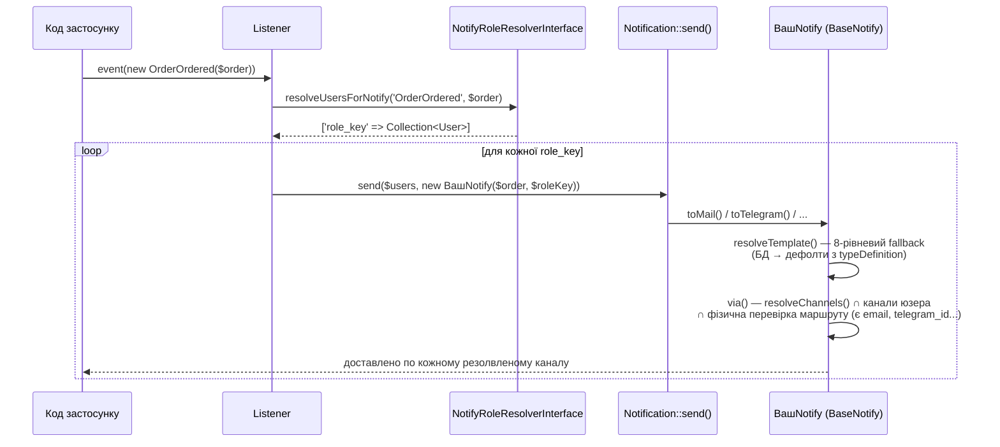
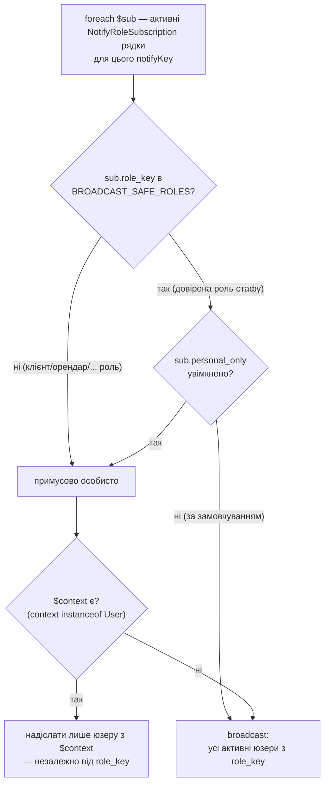

# laravel-notify-templates

[](https://packagist.org/packages/fomvasss/laravel-notify-templates)
[](https://packagist.org/packages/fomvasss/laravel-notify-templates)
[](https://packagist.org/packages/fomvasss/laravel-notify-templates)

DB-шаблони сповіщень для Laravel. Управляє шаблонами, підписками ролей/користувачів, розв'язанням каналів і затримкою — без прив'язки до конкретного пакету ролей.

> English: [README.md](README.md)

---

## Концепції

- **`notify_templates`** — subject/body по типу сповіщення + слот каналу + роль + тенант, з ланцюжком fallback
- **`notify_role_subscriptions`** — які типи активні для якої ролі (канали, затримка, personal_only)
- **`notify_user_settings`** — персональне вимкнення конкретного типу сповіщення (поліморфна — працює з будь-якою Eloquent-моделлю, не лише `User`)
- **`BaseNotify`** — абстрактний базовий клас; розв'язує шаблони та канали; конкретні класи живуть у додатку
- **`NotifyTemplatesManager`** — реєстр типів + методи розв'язання, доступний через фасад `NotifyTemplates`

---

## Встановлення

```bash
composer require fomvasss/laravel-notify-templates
```

Опублікувати та запустити міграції:

```bash
php artisan vendor:publish --tag=notify-templates-migrations
php artisan migrate
```

Опублікувати конфіг (опціонально):

```bash
php artisan vendor:publish --tag=notify-templates-config
```

---

## Конфігурація

`config/notify-templates.php`:

```php
return [
    'tables' => [
        'notify_templates'          => 'notify_templates',
        'notify_role_subscriptions' => 'notify_role_subscriptions',
    ],

    // Усі канали доставки що реалізовані в проекті.
    // Використовується як список у UI та як fallback коли typeDefinition()['channels'] порожній.
    'channels' => ['mail', 'telegram', 'sms', 'database', 'broadcast'],

    // Канали за замовчуванням — коли підписка не має налаштованих каналів
    // або via() нічого не розв'язав
    'default_channels' => ['mail'],

    // null — однотенантний. Або callable що повертає рядок ID тенанта.
    // Використовується автоматично в NotifyTemplatesManager (resolveTemplate/resolveChannels/
    // resolveDelay, а отже й BaseNotify), коли $tenantId явно не передано — виставте
    // $this->tenantId у конкретному Notify-класі, щоб перевизначити per-instance.
    'tenant_id' => null,

    // Директорії для авто-виявлення підкласів BaseNotify при завантаженні
    'discover' => [
        app_path('Notifications'),
    ],

    // Статична реєстрація типів через конфіг
    'types' => [],

    // Перевизначення моделей (наприклад, для підтримки перекладів)
    'models' => [
        'notify_template' => \Fomvasss\NotifyTemplates\Models\NotifyTemplate::class,
    ],
];
```

---

## Реєстрація типів

### Авто-виявлення (рекомендовано)

Пакет сканує `app/Notifications` при кожному завантаженні — рекурсивно, включаючи підпапки. Знаходить усі класи що розширюють `BaseNotify` і повертають непорожній `typeDefinition()`.

```php
// config/notify-templates.php
'discover' => [
    app_path('Notifications'),
],
```

Щоб вимкнути — встановіть `[]`.

### Ручна реєстрація

```php
// AppServiceProvider::boot()
NotifyTemplates::registerTypes([
    [
        'key'      => 'OrderOrdered',
        'name'     => 'Замовлення оформлено',
        'group'    => 'order',
        'weight'   => 10,
        'channels' => ['mail', 'sms'], // порожньо = усі канали з конфігу
        'settings' => ['delay'],
        'tokens'   => [
            ['key' => '[order:number]', 'name' => 'Номер замовлення'],
        ],
        'defaults' => [
            'mail'      => ['subject' => 'Замовлення #[order:number]', 'body' => 'Ваше замовлення оформлено.'],
            'messenger' => ['body' => 'Замовлення #[order:number] оформлено.'],
        ],
    ],
]);
```

### Поля typeDefinition()

| Поле | Тип | Опис |
|---|---|---|
| `key` | string | Унікальний ідентифікатор, напр. `'OrderOrdered'` |
| `name` | string | Назва для UI |
| `group` | string | Група для таблиць UI, напр. `'order'` |
| `weight` | int | Вага сортування в межах групи |
| `channels` | array | Канали цього типу. Порожньо — fallback на `config('notify-templates.channels')` |
| `settings` | array | Ключі налаштувань що редагуються в адмінці; зберігаються в `options` підписки |
| `tokens` | array | Підказки токенів для редактора шаблону |
| `defaults` | array | Дефолтні subject/body по слоту каналу |

Єдиний ключ що пакет читає нативно в `settings` — `delay` (затримка в хвилинах):

```php
'settings' => ['delay']
// options = {"delay": 5} → resolveDelay() поверне 300 секунд
```

**Довільні ключі.** `registerType()` зберігає весь масив з `typeDefinition()` як є — будь-який ключ поза таблицею
вище спокійно доїде назад через `NotifyTemplates::getType($notifyKey)['твій_ключ']`. Зручно для розширення
поведінки конкретного проекту без форку пакету — напр. `allowed_roles`, коли тип сповіщення структурно
стосується лише однієї ролі (OTP-код завжди йде напряму юзеру, що логіниться — заводити шаблон під іншу роль
нема сенсу, він ніколи не використається), перевірка — вже на рівні власного admin-контролера/UI, не пакету.

---

## Конкретні класи сповіщень

```bash
php artisan notify:make OrderOrderedNotify
```

```php
final class OrderOrderedNotify extends BaseNotify implements ShouldQueue
{
    use Queueable;

    public function __construct(
        protected string $roleKey,
        protected Order $order,
    ) {}

    protected function prepareText(string $text, mixed $notifiable): string
    {
        return str_replace('[order:number]', $this->order->number, $text);
    }

    public static function typeDefinition(): array
    {
        return [
            'key'      => 'OrderOrdered',
            'name'     => 'Замовлення оформлено',
            'group'    => 'order',
            'weight'   => 10,
            'channels' => [],
            'settings' => ['delay'],
            'tokens'   => [
                ['key' => '[order:number]', 'name' => 'Номер замовлення'],
            ],
            'defaults' => [
                'mail'      => ['subject' => 'Замовлення #[order:number]', 'body' => ''],
                'messenger' => ['body' => ''],
            ],
        ];
    }
}
```

Хуки що можна перевизначати:
- `prepareText(string $text, mixed $notifiable): string` — заміна токенів/шорткодів
- `via(mixed $notifiable): array` — розширення списку каналів (викликайте `parent::via()`)
- `resolveTemplate(string $channel): ?NotifyTemplate` — доступ до розв'язаного шаблону

### only() / except()

```php
// примусово лише mail
$user->notify((new OrderOrderedNotify('client', $order))->only(['mail']));

// усі розв'язані канали крім sms
$user->notify((new OrderOrderedNotify('client', $order))->except(['sms']));
```

---

## Слухачі та відправка

Повний флоу, від події до доставки:



```php
use Fomvasss\NotifyTemplates\Contracts\NotifyRoleResolverInterface;
use Fomvasss\NotifyTemplates\Facades\NotifyTemplates;
use Illuminate\Support\Facades\Notification;

class OrderOrderedListener
{
    public function __construct(private NotifyRoleResolverInterface $resolver) {}

    public function handle(OrderOrdered $event): void
    {
        $order = $event->order->fresh();

        foreach ($this->resolver->resolveUsersForNotify('OrderOrdered', $order) as $roleKey => $users) {
            $delay = NotifyTemplates::resolveDelay('OrderOrdered', $roleKey);

            Notification::send(
                $users,
                (new OrderOrderedNotify($order, $roleKey))->delay($delay),
            );
        }
    }
}
```

---

## Модель User

Визначте метод `getNotifyChannels()` для персональних налаштувань каналів:

```php
class User extends Authenticatable
{
    public function getNotifyChannels(): array
    {
        return $this->notify_channels ?? []; // з колонки в БД
    }
}
```

Результат **перетинається** з каналами підписки ролі — юзер може відписатись від каналу, але не додати новий понад те що дозволяє роль. Якщо метод відсутній або повертає `[]` — використовуються усі канали підписки.

### Персональне вимкнення типу і override каналів (`notify_user_settings`)

Дві незалежні опційні речі, які notifiable може зафіксувати на тип сповіщення — обидві в тому самому рядку, обидві за замовчуванням "не кастомізовано":

- **`is_enabled`** — вимкнути конкретний тип повністю (напр. "не пиши мені про X, решта — можна"). Перевіряється автоматично в `BaseNotify::via()`:
  ```php
  if (!$this->manager()->isNotifyEnabled($this->getNotifyKey(), $notifiable)) {
      return [];
  }
  ```
- **`channels`** — обмежити *саме цей тип* підмножиною каналів, напр. "OrderOrdered — лише телеграмом", тоді як решта типів і далі йде за глобальним `getNotifyChannels()` цього notifiable. Тільки звужує, ніколи не розширює — перетинається з глобальним налаштуванням, тож не можна маршрутизувати в канал, який notifiable не підключив:
  ```php
  $override = $this->manager()->resolveNotifyUserChannels($this->getNotifyKey(), $notifiable); // null = без override
  ```

Обидва працюють для **будь-якої** Eloquent-моделі — жодного трейта чи інтерфейсу на notifiable не потрібно. Відсутність рядка = повний дефолт (увімкнено, без override каналів). Рядок з'являється лише тоді, коли щось явно зафіксовано — типово з форми налаштувань профілю:

```php
NotifyUserSetting::updateOrCreate(
    ['notifiable_type' => $user->getMorphClass(), 'notifiable_id' => $user->getKey(), 'notify_key' => 'OrderOrdered'],
    ['is_enabled' => true, 'channels' => ['telegram']],
);
```

Щоб прочитати поточний стан поза `Notification` (напр. для тумблера у формі налаштувань) — або запит напряму до `NotifyUserSetting`, або фасад `NotifyTemplates::isNotifyEnabled($notifyKey, $user)` / `NotifyTemplates::resolveNotifyUserChannels($notifyKey, $user)`, або додати `HasNotifySettings` до моделі (там уже є `isNotifyEnabled()` поряд з `getNotifyChannels()`).

Колонка `notifiable_id` — рядок, не integer FK, тому працює незалежно від того, автоінкрементні первинні ключі в додатку чи UUID.

### Типи, які не можна кастомізувати (OTP, коди безпеки)

Деякі типи сповіщень не можна дозволяти notifiable вимикати чи обмежувати каналом — напр. OTP-код входу: якщо юзер зможе вимкнути його у профілі, він сам собі заблокує вхід. Позначити тип через `typeDefinition()`:

```php
public static function typeDefinition(): array
{
    return [
        'key' => 'UserOtp',
        'name' => 'Код входу',
        'group' => 'user',
        'user_configurable' => false, // дефолт true
    ];
}
```

З `user_configurable: false` — `isNotifyEnabled()` завжди повертає `true`, `resolveNotifyUserChannels()` завжди `null` для цього типу, незалежно від того, чи існує для нього рядок у `notify_user_settings` (захист на рівні даних, не лише приховування в UI). `NotifyTemplates::isUserConfigurable($notifyKey)` — щоб відфільтрувати такі типи зі списку тумблерів у формі налаштувань.

---

## NotifyRoleResolverInterface

Визначає яких юзерів отримують сповіщення певного типу:

```php
use Fomvasss\NotifyTemplates\Contracts\NotifyRoleResolverInterface;
use Fomvasss\NotifyTemplates\Models\NotifyRoleSubscription;

class NotifyRoleResolver implements NotifyRoleResolverInterface
{
    // Ролі, яким довіряємо broadcast "усім носіям ролі" — внутрішній довірений стаф.
    // Whitelist, не blacklist: будь-яка роль, якої тут нема (і кожна майбутня нова роль, про яку
    // забудуть згадати тут), за замовчуванням трактується як "багато непов'язаних людей" і йде
    // тільки персонально. Без цього whitelist — рядок підписки, створений з дефолтним
    // personal_only=false (напр. лениво, через firstOrNew() при першому відкритті адмінки для
    // нового типу сповіщення), одразу і мовчки розсилає всім носіям ролі. Для ролі з десятками
    // непов'язаних акаунтів (клієнти, орендарі) це витік чужих даних (посилання-запрошення,
    // згенерований пароль тощо) усім іншим.
    private const BROADCAST_SAFE_ROLES = ['admin'];

    public function resolveUsersForNotify(string $notifyKey, mixed $context = null): array
    {
        $subscriptions = NotifyRoleSubscription::query()
            ->active()
            ->forNotify($notifyKey)
            ->get();

        $result = [];

        foreach ($subscriptions as $sub) {
            $forcePersonal = !in_array($sub->role_key, self::BROADCAST_SAFE_ROLES, true);

            if (($sub->personal_only || $forcePersonal) && $context?->user) {
                $result[$sub->role_key] = collect([$context->user]);
            } else {
                $result[$sub->role_key] = User::role($sub->role_key)
                    ->where('status', User::STATUS_ACTIVE)
                    ->get();
            }
        }

        return $result;
    }
}
```

```php
// AppServiceProvider::register()
$this->app->bind(NotifyRoleResolverInterface::class, NotifyRoleResolver::class);
```

> **Важливо:** `personal_only`, звідки б не взявся (чекбокс чи форс вище), підміняє аудиторію на `$context`'s
> user **незалежно від ролі рядка** — увімкнувши його на `BROADCAST_SAFE_ROLES`-рядку (напр. `admin`), лист піде
> не реальному стафу, а тій самій контекстній людині, просто під шаблоном цієї ролі. Концепції "оцей конкретний
> адмін особисто" в системі немає — лише "людина, якої стосується подія" проти "всі носії ролі".



---

## Ланцюжок fallback шаблонів (8 рівнів)

Для кожного сповіщення пакет шукає найточніший шаблон у БД:

```
(channel + role + tenant)
(channel + role)
(channel + tenant)
(channel)
(null + role + tenant)
(null + role)
(null + tenant)
(null)
```

Специфічніший завжди виграє. Якщо шаблон не знайдено — використовуються `defaults` з `typeDefinition()`.

---

## personal_only

Прапор `personal_only` на `notify_role_subscriptions` — надсилати лише конкретній людині з контексту події, а не всім юзерам з цією роллю. Логіка реалізується на стороні додатку в `NotifyRoleResolverInterface::resolveUsersForNotify()` (див. розділ вище — там і про `BROADCAST_SAFE_ROLES`-whitelist, без якого дефолтне `personal_only=false` на ролі з багатьма непов'язаними акаунтами означає розсилку всім одразу).

---

## API фасаду

```php
NotifyTemplates::registerType(array $type): void
NotifyTemplates::registerTypes(array $types): void
NotifyTemplates::discoverIn(string $path): void
NotifyTemplates::getTypes(?string $group = null): array
NotifyTemplates::getType(string $key): ?array
NotifyTemplates::getTypeChannels(string $notifyKey): array

NotifyTemplates::resolveTemplate(string $notifyKey, string $channel, ?string $roleKey, ?string $tenantId): ?NotifyTemplate
NotifyTemplates::resolveChannels(string $notifyKey, string $roleKey, ?string $tenantId, array $userChannels = []): array
NotifyTemplates::resolveDelay(string $notifyKey, string $roleKey, ?string $tenantId): int
```

---

## Порядок вирішення каналів

Кожне сповіщення проходить фіксований ланцюг всередині `via()`. Кожен крок може лише звужувати канали — розширити те, що відфільтрував попередній крок, неможливо. `typeDefinition()['channels']` / `getTypeChannels()` **не** входять у цей ланцюг — це окремий, суто UI-довідник (див. примітку внизу).

```
0. isNotifyEnabled(notifyKey, notifiable)
       чи не вимкнув notifiable весь тип цілком? (notify_user_settings.is_enabled)
       'user_configurable' => false у typeDefinition() → завжди true, рядок (якщо є) ігнорується
       false → via() одразу повертає [], решта кроків не виконується
       ↓
1. getNotifyChannels()   (на notifiable — опційний метод)
       глобальна канальна преференція самого notifiable
       метод відсутній → трактується як "без обмежень", не "нема каналів"
       ↓
2. resolveNotifyUserChannels(notifyKey, notifiable)
       per-type override (notify_user_settings.channels) — звужує крок 1, лише для цього одного типу
       'user_configurable' => false → завжди null, рядок (якщо є) ігнорується
       null → без додаткового звуження понад крок 1
       ↓
3. notify_role_subscriptions.channels   (задається в адмін-UI)
       які канали увімкнені для пари роль+тип сповіщення
       порожній → fallback до config('notify-templates.default_channels')
       перетинається з об'єднаним результатом кроків 1+2 (notifiable може лише відписатись, не додати канал, якого роль не дозволяє)
       ↓
4. routeNotificationFor*() / перевірка властивості (напр. mail потребує ->email)
       фізична перевірка: чи є у notifiable реально email / telegram id / тощо?
       канал мовчки відкидається, якщо маршрут/властивість порожні
       якщо нічого не вижило → fallback до config('notify-templates.default_channels')
       ↓
5. only() / except()   (виклик у коді)
       застосовується останнім, завжди має пріоритет
```

**Практичні приклади:**

| Сценарій | Результат |
|---|---|
| Немає підписок у БД, нічого не налаштовано | `mail` (з `default_channels`) |
| Підписка активна, `channels = []` у БД | `mail` (з `default_channels`) |
| Підписка `['mail','telegram']`, у юзера нема telegram id | тільки `mail` |
| Підписка `['mail','telegram']`, `getNotifyChannels()` повертає `['mail']` | тільки `mail` |
| Підписка `['mail','telegram']`, юзер хоче обидва, але для цього типу є `notify_user_settings.channels = ['telegram']` | тільки `telegram` — лише для цього типу, інші не зачіпає |
| `notify_user_settings.is_enabled = false` для типу, але `typeDefinition()['user_configurable'] = false` | все одно надсилається — рядок вимкнення ігнорується |
| `->only(['telegram'])` на місці виклику | тільки `telegram`, незалежно від підписки |

`config('notify-templates.channels')` і `typeDefinition()['channels']` (через `getTypeChannels()`) — це лише **список для UI**: визначають чекбокси на формі редагування в адмінці. Жоден з них напряму не впливає на ланцюг вище.

---

## Журнал змін

Дивіться [CHANGELOG.md](CHANGELOG.md).

## Ліцензія

MIT — [LICENSE.md](LICENSE.md).
