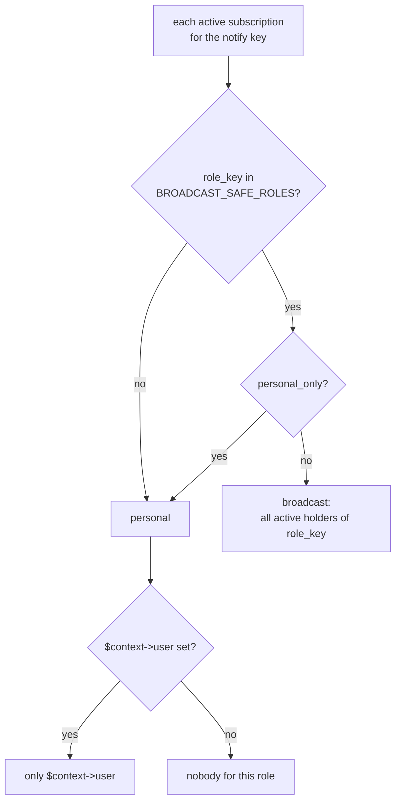

# Recipients & role subscriptions

Who receives a notification is decided in two places:

- **`notify_role_subscriptions`** — rows the admin edits: which roles get which notify type, through which channels, with what options.
- **`NotifyRoleResolverInterface`** — your code: turns active subscriptions into actual notifiables, using whatever role system the app has (Spatie permission, a `role` column, …).

## Role subscriptions

| Column | Meaning |
|---|---|
| `role_key` | Your role identifier |
| `notify_key` | Notify type key |
| `tenant_id` | `null` = all tenants; a value = only that tenant, preferred over the global row |
| `is_active` | `false` disables the type for the role |
| `personal_only` | Read by your resolver only: send to the person the event is about instead of every holder of the role |
| `channels` | Channel slugs, e.g. `["mail", "telegram"]`; empty = `default_channels` |
| `options` | Values of the type's `settings`, e.g. `{"delay": 5}` (minutes) |

There is one row per role + notify type + tenant (unique index `nrs_unique`). The package itself reads the row in `resolveChannels()` (`is_active`, `channels`) and `resolveDelay()` (`options.delay`); it never reads `personal_only`.

Example data:

| role_key | notify_key | tenant_id | is_active | personal_only | channels | options |
|---|---|---|---|---|---|---|
| client | OrderOrdered | null | 1 | 1 | `["mail","sms"]` | `{"delay": 0}` |
| manager | OrderOrdered | null | 1 | 0 | `["mail","telegram"]` | `{"delay": 0}` |
| client | OrderOrdered | shop-ua | 1 | 1 | `["mail","telegram"]` | `{"delay": 2}` |

A tenant row replaces the global one completely, including `is_active`: an inactive `shop-ua` row disables the type for that tenant even if the global row is active.

## The resolver

```php
interface NotifyRoleResolverInterface
{
    /** @return array<string, iterable> ['role_key' => notifiables] */
    public function resolveUsersForNotify(string $notifyKey, mixed $context = null): array;
}
```

`$context` is whatever your listener passes — usually the domain model (Order, Lead, User). An implementation on Spatie roles:

```php
use Fomvasss\NotifyTemplates\Contracts\NotifyRoleResolverInterface;
use Fomvasss\NotifyTemplates\Facades\NotifyTemplates;
use Fomvasss\NotifyTemplates\Models\NotifyRoleSubscription;

class AppNotifyRoleResolver implements NotifyRoleResolverInterface
{
    // Roles that may receive a broadcast to every holder — internal staff. Every other role
    // is personal-only, whatever its subscription says.
    private const BROADCAST_SAFE_ROLES = ['admin', 'manager'];

    public function resolveUsersForNotify(string $notifyKey, mixed $context = null): array
    {
        $subscriptions = NotifyRoleSubscription::query()
            ->active()
            ->forNotify($notifyKey)
            ->forTenant(NotifyTemplates::resolveTenantId(null))
            ->get();

        $result = [];

        foreach ($subscriptions as $sub) {
            $personal = $sub->personal_only || !in_array($sub->role_key, self::BROADCAST_SAFE_ROLES, true);

            if ($personal) {
                if ($user = $context?->user) {
                    $result[$sub->role_key] = collect([$user]);
                }

                continue;
            }

            $result[$sub->role_key] = User::role($sub->role_key)->where('status', User::STATUS_ACTIVE)->get();
        }

        return $result;
    }
}
```

```php
// AppServiceProvider::register()
$this->app->bind(NotifyRoleResolverInterface::class, AppNotifyRoleResolver::class);
```

> [!WARNING]
> Keep a whitelist of roles that may be broadcast to. `personal_only` defaults to `false`, so a subscription created lazily — say with `firstOrNew()` the first time someone opens the admin form of a new type — means "every holder of the role". For a customer or tenant role that leaks one person's event (an invite link, a generated password) to everyone on the platform. The same goes for a personal subscription with no context user: skip the role rather than falling back to a broadcast.



`personal_only` redirects delivery to the context's user **whatever role the subscription belongs to**. On an `admin` row it doesn't pick "one admin"; it sends the admin template to the customer the event is about. There is no notion of "this particular staff member" — only "the person the event is about" versus "everyone with the role".

## Scopes

| Scope | Condition |
|---|---|
| `active()` | `is_active = true` |
| `forNotify($key)` | `notify_key = $key` |
| `forTenant($tenantId)` | with a tenant: that tenant's rows **and** global rows; with `null`: global rows only |

`forTenant()` returns both the tenant row and the global row of the same role. The resolver above then lists the role once (array key), and `via()` uses the tenant row, so the result is consistent. If the tenant row is inactive and the global one active, the role is still resolved but `via()` returns no channels.

Unlike the manager, `forTenant()` doesn't fall back to `config('notify-templates.tenant_id')` — pass `NotifyTemplates::resolveTenantId(null)` as above.
