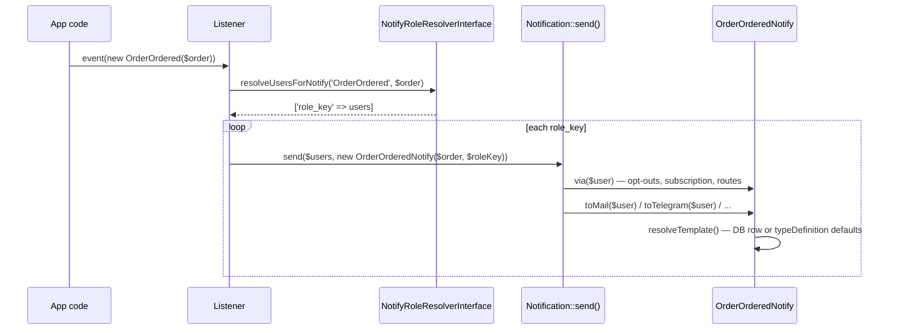

# Sending notifications

A `BaseNotify` subclass is an ordinary Laravel notification: send it with `$notifiable->notify()` or `Notification::send()`. What the package adds happens inside it — `via()` decides the channels, `toMail()` / `toArray()` pick the template.

Two sending patterns cover most cases.

## Per role, from an event listener

The event fires; the listener asks your [recipient resolver](recipients.md) who should get it, grouped by role, and sends one notification per role so each role gets its own template and channels:

```php
use App\Events\OrderOrdered;
use App\Notifications\OrderOrderedNotify;
use Fomvasss\NotifyTemplates\Contracts\NotifyRoleResolverInterface;
use Fomvasss\NotifyTemplates\Facades\NotifyTemplates;
use Illuminate\Support\Facades\Notification;

class SendOrderOrderedNotifications
{
    public function __construct(protected NotifyRoleResolverInterface $resolver) {}

    public function handle(OrderOrdered $event): void
    {
        $order = $event->order->fresh();

        foreach ($this->resolver->resolveUsersForNotify('OrderOrdered', $order) as $roleKey => $users) {
            Notification::send(
                $users,
                (new OrderOrderedNotify($order, $roleKey))
                    ->delay(NotifyTemplates::resolveDelay('OrderOrdered', $roleKey)),
            );
        }
    }
}
```



`resolveDelay()` returns seconds from the subscription's `options.delay` (minutes), `0` without a subscription. `delay()` comes from `Queueable` and works only for queued notifications.

## Directly, to one notifiable

For notifications triggered by the user's own action — a login code, a password reset — send to the user directly with the role whose subscription and template apply:

```php
$user->notify(new UserOtpNotify(roleKey: 'client', code: $code));
```

Mark such types `'user_configurable' => false` when they must always arrive: they then go out through `default_channels` even without an active subscription. See [User preferences](user-preferences.md#non-configurable-types).

## Narrowing channels at the call site

`only()` and `except()` are applied last in `via()`:

```php
// only the mail out of the resolved channels
$user->notify((new UserOtpNotify(roleKey: 'client', code: $code))->only(['mail']));

// all resolved channels except sms
$user->notify((new OrderOrderedNotify($order, 'client'))->except(['sms']));
```

> [!WARNING]
> Both only **filter** what was resolved; neither adds a channel. `->only(['telegram'])` sends nothing when Telegram isn't in the subscription or the user has no Telegram route. They compare against the values `mapChannel()` returned, so for a channel mapped to a class name pass the class: `->except([TurboSmsChannel::class])`, not `'sms'`.

To force channels regardless of subscriptions, bypass `via()` with Laravel's own `sendNow()`:

```php
Notification::sendNow($user, new UserOtpNotify(roleKey: 'client', code: $code), ['mail']);
```

## On-demand recipients

Sending to an address without a model (`Notification::route()`) works, but the built-in `mapChannel()` drops `mail` for it: it checks `$notifiable->email`, which `AnonymousNotifiable` doesn't have. Map mail by the route instead — this works for models and on-demand recipients alike:

```php
protected function mapChannel(string $channel, mixed $notifiable): ?string
{
    return match ($channel) {
        'mail' => $notifiable->routeNotificationFor('mail', $this) ? 'mail' : null,
        default => parent::mapChannel($channel, $notifiable),
    };
}
```

```php
Notification::route('mail', 'guest@example.com')
    ->notify(new OrderOrderedNotify($order, 'guest'));
```

The same check also fixes models whose address isn't in an `email` attribute but in a `routeNotificationForMail()` method. For an on-demand recipient there are no user preferences: `isNotifyEnabled()` is always `true` and no per-user channel preference applies; the role subscription still does. See [Custom channels](custom-channels.md) for the rest of `mapChannel()`.

## What each channel sends

| Channel | Method | Content |
|---|---|---|
| `mail` | `toMail()` | Template slot `mail`: subject and body through `prepareText()` |
| `database`, `broadcast` | `toArray()` | `['message' => strip_tags(...)]` of the messenger body |
| custom (Telegram, SMS, …) | your `to{Channel}()` | Usually `getMessengerBody()` — slot `messenger`, falling back to `mail` |

> [!NOTE]
> The default `toMail()` puts the whole body into one `MailMessage::line()`. Laravel escapes HTML in a line and joins its line breaks into one paragraph, so a multi-paragraph or HTML body needs a custom `toMail()` with its own view — see [Custom channels](custom-channels.md#a-custom-mail-view).

Token substitution is your `prepareText()` — see [Templates](templates.md#tokens).
